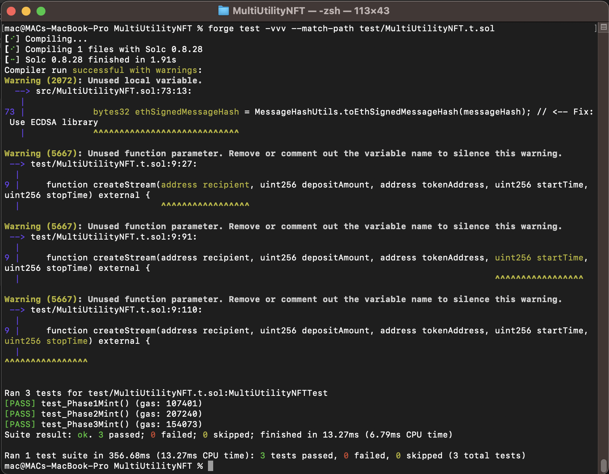

# Multi-Utility NFT Contract

A smart contract implementing phased NFT minting with Merkle proofs, discounted signatures, and Sablier vesting.

## Contract Design

### Core Components

1. **Phased Minting**
   - **Phase 1**: Whitelisted users mint for free using Merkle proofs.
   - **Phase 2**: Approved users mint at a discount with owner-signed signatures.
   - **Phase 3**: Public minting at full price.

2. **Token Integration**
   - Utilizes ERC20 (`PaymentToken`) for payments.
   - Implements ERC721 for NFTs.

3. **Vesting**
   - Locks minting fees in Sablier's linear vesting schedule.
   - 1-year vesting period (configurable).

4. **Security**
   - Reentrancy protection.
   - Signature non-reuse system.
   - Input validation for Merkle proofs.

## Key Features

- 🛡️ **Merkle Proof Verification**  
  Utilizes OpenZeppelin's Merkle proofs for phase-based access control.

- 🔑 **ECDSA Signatures**  
  Phase 2 requires valid owner-signed discount approvals.

- 💰 **Sablier Integration**  
  Automatically creates vesting streams for collected fees.

- 🚫 **Anti-Abuse Protections**
  - Signature expiration tracking.
  - Phase transition locking.
  - ERC20 allowance checks.


### Security Considerations

- Verifies that the caller has sufficient `PaymentToken` balance and has approved the contract to spend the required amount.
- Utilizes OpenZeppelin's `ReentrancyGuard` to prevent reentrancy attacks during the token transfer and minting process.
- Ensures the contract is in the correct phase (`Phase3`) before allowing minting.


## Testing Approach

### Test Coverage Goals

1. **Phased Minting Validation**
   - Valid/invalid Merkle proofs.
   - Phase transition checks.
   - Payment amount verification.

2. **Edge Cases**
   - Signature reuse attempts.
   - Invalid phase access.
   - Insufficient token allowances.

3. **Vesting Flow**
   - Owner-only vesting trigger.
   - Sablier stream creation.
   - Post-vesting fund locking.

### Branching Tree Technique (BTT)

- Tests 2 main execution paths:
  1. Phase 1 -> Phase 2 -> Phase 3
  2. Direct Phase 3 access
  3. Invalid phase transitions

### Compilation and Test Screenshot



## Compilation and Test Screenshot
[Coverage Report](./lcov.info)


### Security Tests

- Reentrancy attacks.
- Signature malleability.
- Merkle proof spoofing.
- Access control violations.

## Getting Started

### Prerequisites

- Foundry (v0.8.0+)
- Node.js (for coverage reporting)

```bash
# Install dependencies
forge install


# Run tests
forge test -vvv --match-path test/MultiUtilityNFT.t.sol

# Generate coverage report
forge coverage --report lcov
```


#### Edge Cases ✅

- Invalid Merkle proofs revert with "Invalid proof".
- Invalid signatures revert with "Invalid signature".
- Reused signatures revert with "Signature reused".

### Coverage Validation

```bash
forge test --match-contract MultiUtilityNFTTest --gas-report
```

